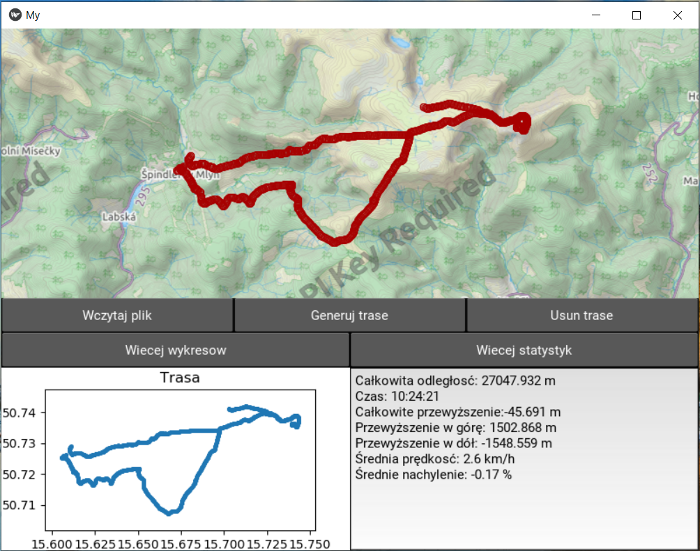

# KivyApp

Simple application in Kivy framework. App reads .gpx file (e.g. from Endomondo) and generates a route on the map. Also generates simple plot with user positions (based on coordinates) and basic statistics. You can also make more advanced plots and show detailed statistics over whole route. Additionaly, app creates an image with advanced plots and file with detailed statistics.

